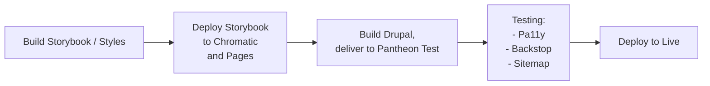
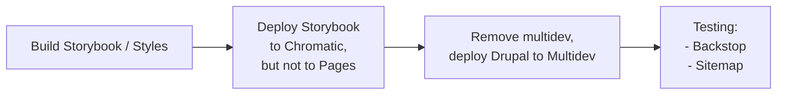

# ODU Global 2023

This is the repository for the 2023 ODU Global website overhaul. It's a Drupal 10 site hosted on Pantheon, with a Storybook pattern library hosted on GitLab Pages (and Chromatic; see below).

For extensive documentation on front-end development in this project, see the `themes/custom/d10starter/README.md` file.

## Important links

- [Comps on Figma](https://www.figma.com/file/jwSDNLRQP5H24mV90KlsJP/ODUGlobal-%7C-Design-System)
- [Storybook on GitLab Pages](https://newcity.pagesfor.us/odu-global-2023/) (`main` branch)
- [Chromatic dashboard](https://www.chromatic.com/builds?appId=642f1bcb798a90589e171afd) (requires credentials; all NewCity personnel should have access automatically if logged into Chromatic with GitLab credentials)
  - [Storybook on Chromatic](https://main--642f1bcb798a90589e171afd.chromatic.com/) (`main` branch)
  - Chromatic will also give us a live Storybook URL for every feature-branch with a merge-request.
  - When Chromatic snapshots are enabled (controlled in `docker/bookbinder/.storybook/preview.ts`), we get visual-regression testing with each commit. At the time of writing, this is disabled in order to conserve snapshots (since there's a monthly limit).
- [Pantheon dashboard](https://dashboard.pantheon.io/sites/ec5865e0-2e2d-47e8-a6e9-8d662858c964) (requires credentials)

## Getting started

### Requirements

- local environmental variables
  - `GITLAB_API_PRIVATE_TOKEN` (required for push/pull to NewCity GitLab repo)
  - `PANTHEON_MACHINE_TOKEN` (optional for accessing Pantheon enviromnents with Terminus)
- Docker (for local development)

### Local development

1. `$ git clone git@gitlab.insidenewcity.com:newcity/odu-global-2023.git`
2. `$ docker compose up -d` to start containers
3. Open the browser terminal at <http://localhost:9001>
   1. Install Drupal core and modules, then import the database from the Pantheon LIVE environment.
   2. `app$ composer install`
   3. `app$ make updatedb`
4. View the site at <http://localhost:9000>
5. View Storybook at <http://localhost:3000>

## CI/CD

### Commits / merges into main

### Commits / merges into branches

## Repository structure
- `/deploy` = drupal settings file, pantheon.yml file
- `/docker` = files to prep/customize docker images
- `/drupal` = composer.json, config
- `/for_webroot` = misc stuff that will be dropped into site root
- `/modules/custom` = custom Drupal modules
- `/private/scripts` = misc private scripts, usually one-time use
- `/scripts` = composer support scripts
- `/test` = scripts that are run during testing
- `/themes` = the Drupal theme
- `.gitlab-ci.yml` = what happens during the pipelines after a commit is pushed
- `docker-compose.yml` = manages containers for local development
